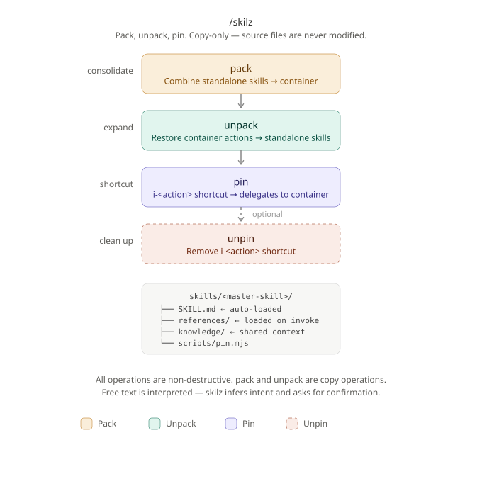

<div align="center">
  
</div>

# skilz


**Turn a pile of standalone skills into a clean, organized skill library in one command.**

---

As your Claude Code skill library grows, flat folders become unmanageable. `skilz` introduces the **container pattern** — a single master skill that routes to on-demand action files, keeping context lean and structure clear.

Pack 10 skills into 1 container. Unpack any container back to standalone. Pin shortcuts so any action is one slash command away.

---

## ⚡ Quick Start

**Install via [skills](https://github.com/vercel-labs/skills):**

```bash
npx skills add alexsmedile/skilz
```

**Pack a group of standalone skills into a container:**

```bash
/skilz pack cs brainstorm strategize generate design-pass
```

**Unpack a container back to standalone:**

```bash
/skilz unpack skills/cs --dest skills/
```

**Pin a single action as its own shortcut:**

```bash
/skilz pin skills/cs brainstorm
# Creates /i-brainstorm → delegates to cs container
```

---

## 📦 Container Architecture

A container is a master skill that loads action logic on demand — only `SKILL.md` is read automatically; everything else is pulled when needed.

**Instead of:**

```
skills/
├── brainstorm/
│   └── SKILL.md
├── generate/
│   └── SKILL.md
└── design/
    └── SKILL.md
```

**You get:**

```
skills/<master-skill>/
├── SKILL.md           ← routing + command menu (<500 lines, auto-loaded)
├── references/        ← per-command logic + shared knowledge, loaded on demand
│   ├── brainstorm.md
│   ├── generate.md
│   ├── design.md
│   └── platforms.md  ← shared knowledge lives here too, same folder
└── scripts/
    └── pin.mjs        ← pin/unpin automation
```



**Why containers?**
- One folder instead of N folders for related skills
- Shared knowledge in `references/` — no duplication across command files
- Master `SKILL.md` stays under 500 lines — no context bloat
- Each command file is independently readable and editable

---

## 🔧 Commands

| Command  | Aliases | What it does |
|----------|---------|--------------|
| `pack`   | wrap, fold, zip, bundle, forge, merge, knit | Pack standalone skills into a container |
| `unpack` | unwrap, unfold, unzip, burst, smelt, split, unravel | Restore container actions as standalone skills |
| `pin`    | link, alias, tap | Create an `i-<action>` redirect skill for one container action |
| `unpin`  | unlink, detach | Remove a redirect skill |
| `status` | info, ls, list | Inspect a container's structure and active pins |

All operations are **non-destructive** — pack and unpack are copy operations. Source files are never modified or deleted.

---

## 📄 pin.mjs

`scripts/pin.mjs` automates pin/unpin without manual file creation. No external dependencies — standard Node.js only.

```bash
# List active pins for a container
node scripts/pin.mjs --list skills/cs

# Create a pin
node scripts/pin.mjs skills/cs brainstorm

# Remove a pin
node scripts/pin.mjs --remove skills/cs brainstorm

# Specify a custom skills directory
node scripts/pin.mjs --skills-dir ~/.claude/skills skills/cs brainstorm
```

The script reads the container's `SKILL.md` frontmatter to extract `name`, `allowed-tools`, and the action's description from the commands table. Pins are automatically symlinked into `.claude/skills/` if that directory exists.

---

## 💾 Installation

**Global (available across all projects):**

```bash
npx skills add alexsmedile/skilz -g
```

**Project-scoped (committed with your project):**

```bash
npx skills add alexsmedile/skilz
```

**Target a specific agent:**

```bash
npx skills add alexsmedile/skilz -a claude-code
```

Invoke as `/skilz <command>` after install.

---

## Who It's For

- Claude Code users managing 10+ skills who want structure
- Anyone building or maintaining a skill container library
- Developers who want to expose individual container actions as top-level shortcuts

## Who It's Not For

- Users with just a few skills (flat structure is fine)
- Non-Claude-Code environments
